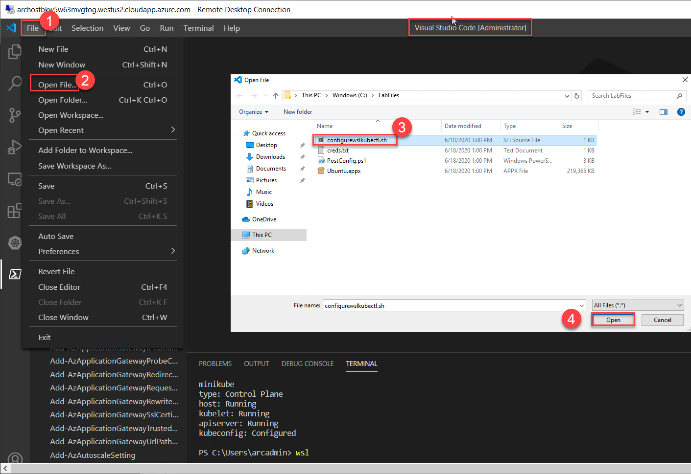
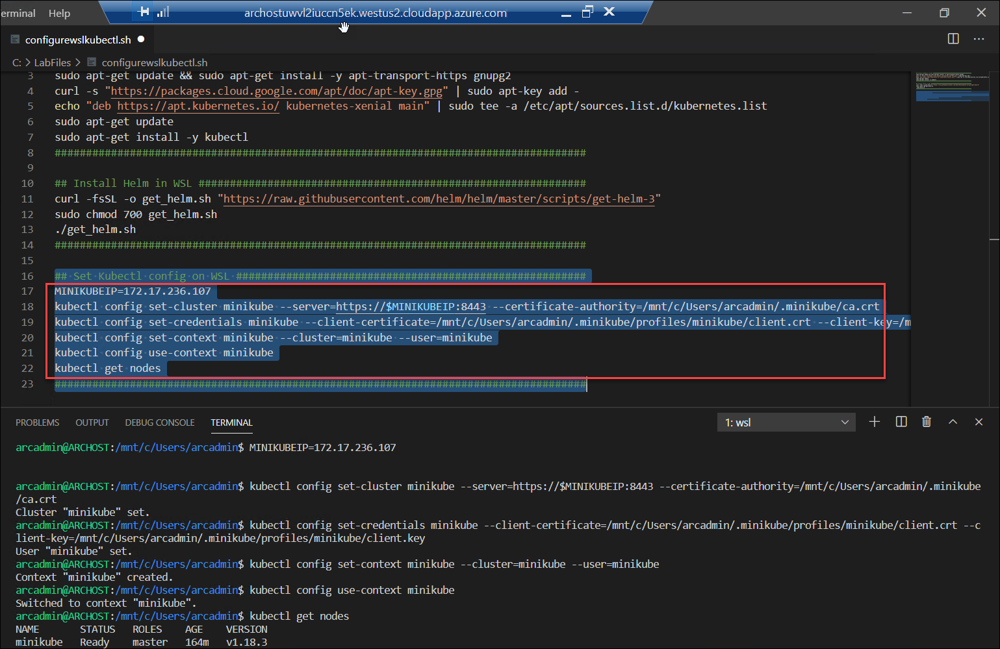

# Exercise 2: Getting started with On-Prem Kubernetes Cluster
In the provided lab environment, you would already have one Windows 10 machine running with Kubernetes Cluster already deployed and running. In this exercise, we’ll connect to the VM and check the existing Kubernetes Cluster

## Task 1: Verify existing Kubernetes Cluster
In this task, you will check the existing Kubernetes cluster and verify if the cluster is up and running. 

1. Type Visual Studio Code in the search bar on the bottom left corner of the VM, Open **Visual Studio Code** option that comes up

    

2. Click on the **Kubernetes** extension and verify whether a cluster with name **minikube** is present.
   
    
   
3. Open the **Powershell terminal** within the Visual studio code .
    
    

4. Run the following command to check the status of the cluster .
   
   ```
   minikube status
   ```
   If the cluster is running, the output from minikube status should be similar to:
   
    
   
   > **Note**: Only, If the cluster status is **Stopped** run the following commands
   
      ```
      minikube delete
      minikube start
      ```
   
  
## Task 2: Connect to Kubernetes cluster using WSL

1. Open the Visual studio code once again and run the following command in the terminal
   
   ```
   wsl
   ```
    
   
   > **Note**: When prompted for password, provide **123456** as password. Username will be arcadmin
 
2. Within the VS Code from the **file** menu, open the file **configurewslkubectl.sh** from the folder **C:\LabFiles**
  
    
    

3. Run all the commands at once **Set Kubectl config on WSL**
 
   
   
 4. Now you can run the command 'exit' to exit out of WSL and be back in the powershell terminal.
 
   ```
   exit
   ```
 
 7. You can chose to use any of the following methods -  Powershell through Visual Studio Code or throught direct Powershell terminal from the desktop for performing the remaining exercises

In this exercise, you explored about how to WSL and Windows Powershell to check if Kubernetes cluster is running in Hyper-V. In the next exercise, you will explore on onboarding the Kubernetes Clusters to Azure Arc.
