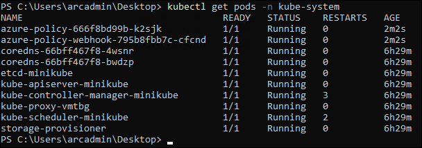
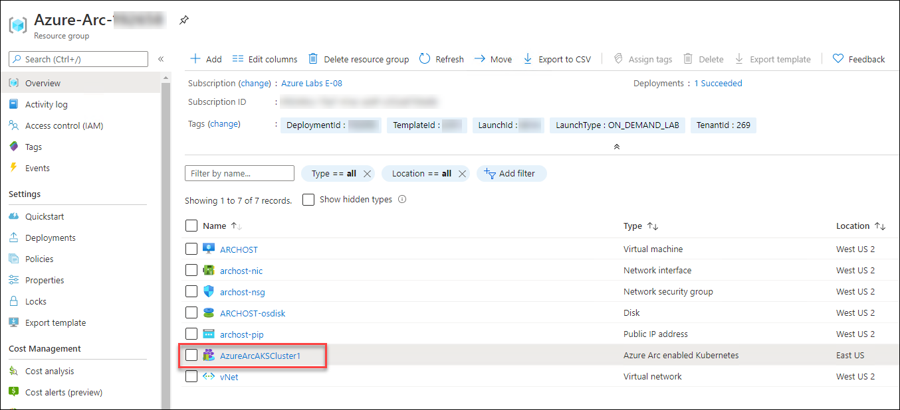
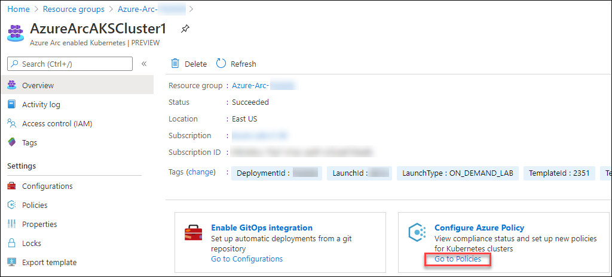
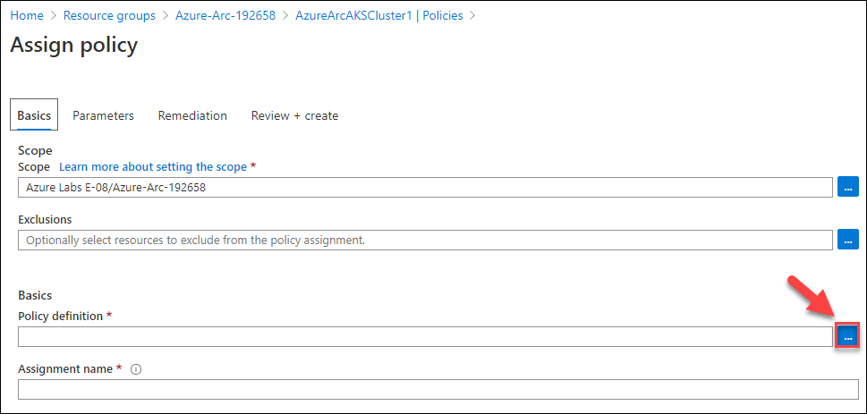
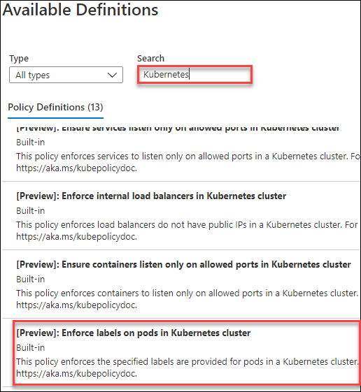
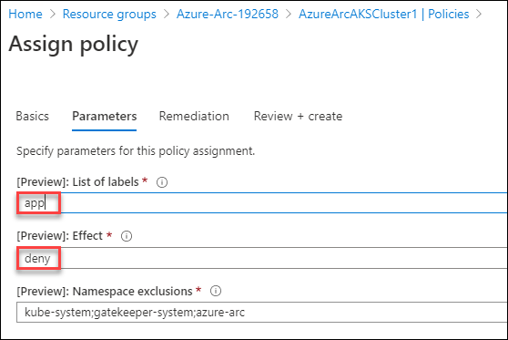
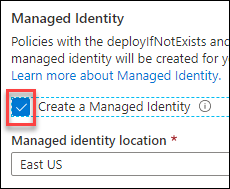
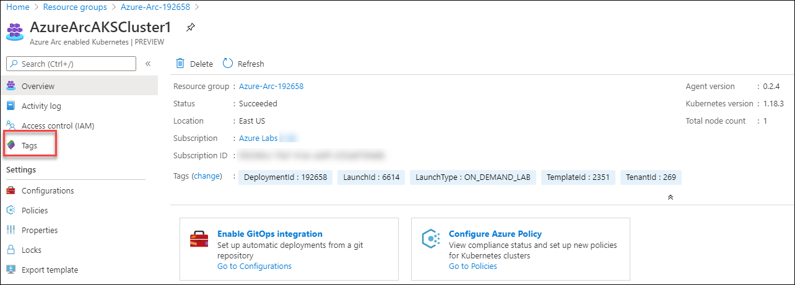
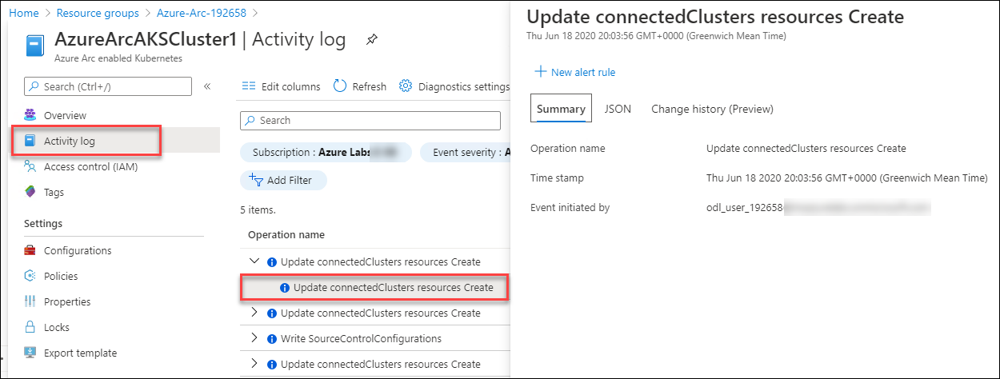
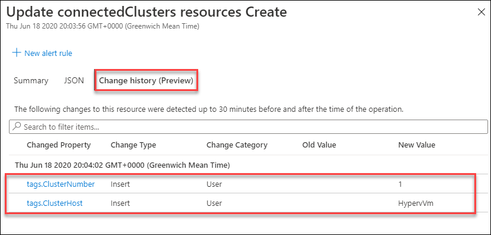

# Exercise 5: Azure Governance for Kubernetes on Azure Arc
In this exercise, you will perform Role assignment, Policy assignment, Tag the Azure Arc Enabled Kubernetes and check Activity logs of resource group and azure arc resource.

You can assign the in-Built policies to enforce configurations on Azure Arc enabled Kubernetes Clusters. You can filter the Clusters and apply the policies based on Tags.

## Task 1: Install Azure Policy Add-on for Azure Arc enabled Kubernetes

Azure Policy extends Gatekeeper v3, an admission controller webhook for Open Policy Agent (OPA), to apply at-scale enforcements and safeguards on your clusters in a centralized, consistent manner. Azure Policy makes it possible to manage and report on the compliance state of your Kubernetes clusters from one place. The add-on enacts the following functions:

     - Checks with Azure Policy service for policy assignments to the cluster.
     - Deploys policy definitions into the cluster as constraint template and constraint custom resources.
     - Reports auditing and compliance details back to Azure Policy service.

1. Assign 'Policy Insights Data Writer (Preview)' role assignment to the Azure Arc enabled Kubernetes cluster. Replace <subscriptionId> with your subscription ID, <rg> with the Azure Arc enabled Kubernetes cluster's resource group, and <clusterName> with the name of the Azure Arc enabled Kubernetes cluster. Keep track of the returned values for appId, password, and tenant for the installation steps. 

    ```
    az ad sp create-for-rbac --role "Policy Insights Data Writer (Preview)" --scopes "/subscriptions/<subscriptionId>/resourceGroups/<rg>/providers/Microsoft.Kubernetes/connectedClusters/<clusterName>"
    ```

2. The output of the above command will will look like below.
	
   

3. Run the following commands in Powershell to add the Azure Policy Add-on repo to Helm.
 
     ```
     helm repo add azure-policy https://raw.githubusercontent.com/Azure/azure-policy/master/extensions/policy-addon-kubernetes/helm-charts 
    ```

   

4. Run the following commands in Powershell to install the Azure Policy Add-on repo to Helm.

   
      
     > **Note**: In below command, replace the following values with those gathered above.
   <AzureArcClusterResourceId> with your Azure Arc enabled Kubernetes cluster resource Id. For example: 	/subscriptions/<subscriptionId>/resourceGroups/<rg>/providers/Microsoft.Kubernetes/connectedClusters/<clusterName>
       <ServicePrincipalAppId> with app Id of the service principal created during prerequisites.
       <ServicePrincipalPassword> with password of the service principal created during prerequisites.
       <ServicePrincipalTenantId> with tenant of the service principal created during prerequisites.
   
   ```
   helm install azure-policy-addon azure-policy/azure-policy-addon-arc-clusters --set azurepolicy.env.resourceid=<AzureArcClusterResourceId> --set azurepolicy.env.clientid=<ServicePrincipalAppId> --set azurepolicy.env.clientsecret=<ServicePrincipalPassword> --set azurepolicy.env.tenantid=<ServicePrincipalTenantId>
   ```

5. Now, to validate that the add-on installation was successful and that the azure-policy and gatekeeper pods are running, run the following commands.
    
   > **Note**: azure-policy pod is installed in kube-system namespace
     ```
	kubectl get pods -n kube-system
     ```
   
   
   > **Note**: gatekeeper pod is installed in gatekeeper-system namespace
    ```
	kubectl get pods -n gatekeeper-system
    ```
   


## Task 2: Apply Policy
Policies can be applied to ARC enabled Kubernetes the same way they are applied to Microsoft Azure virtual machines. Policies can be applied to ensure the Azure resources are compliant with established practices such as ensuring that all resources are tagged with an owner. Policies can be applied to ensure the Azure arc enabled clusters are compliant such as ensuring the cluster configuration is set through a specific repo or enforcing a specific label on a pod.

1. From the Azure Portal (https://portal.azure.com ), navigate to the resource group you have access to and click on AzureArcAKSCluster1 resource. 

   

2. From the **Azure Arc Enabled Kuberenetes** blade, click on **Go to Policies** under Configure Azure Policy.

   

3. Click **Assign policy**.

   

4. On the Basics Tab, click on the ellipses (…) to the right of **Policy definition**.

   

5. In the **Search** window for available definitions, type “Kubernetes ” and select the one called **Enforce labels on pods in Kubernetes cluster**.  Click the blue **Select** button below.

   

6. Click **Next** at the bottom of the window.

7. Provide  **Cluster1** against List of label field and Click **Next**

   
   
8. Select the **Create a Managed Identity** check box and the click **Next** again

   

9. Then at the bottom of the **Assign Policy** window click on **Create**.


10. Navigate to **Azure-Arc RG** -> **AzureArcAKSCluster1** -> **Policies**.

11. You can check if your cluster is **compliant** or **not** against **“[Preview]: Enforce labels on pods in Kubernetes cluster”** policy you assigned in previous step by looking at the Compliance State Column

    

12. You can check if the pods have app label or not by executing the following command in the powershell window:

  ```
  kubectl get pods --show-labels
  ```

   

   > **Note**: If you find **non-compliant**, you will need to update the configuration file to apply the tag and after sometime you will see the complaint state changed to **Compliant**

    
## Task 3: Tag your Azure Arc enabled Kubernetes

1. Navigate to the Azure portal.

2. Then navigate to the Azure Arc enabled Kubernetes resource Azure-Arc RG-> AzureArcAKSCluster1

3. After clicking on it, Click on **Tags** in the center blade

   

4. Create the following tags and then Save them
   
    Tag Name | Value
    --- | ---
    ClusterNumber | `1`
    ClusterHost | `HypervVm`

5. After saving them they should look like this.&nbsp;&nbsp;

   

## Task 4: Activity Logs
In the previous task, you added **tags** to one of the **Azure Arc enabled Kubernetes**. Now, you will check the **activity logs** for that.

1. In this step, click on the **Activity logs**, you will see **Update connectedClusters resources Create** operation is performed. Expand the operation and click on the one of **expanded operation**.

   

2. Now, click on the **Change history (Preview)**, you can see multiple Tags inserted.

   
